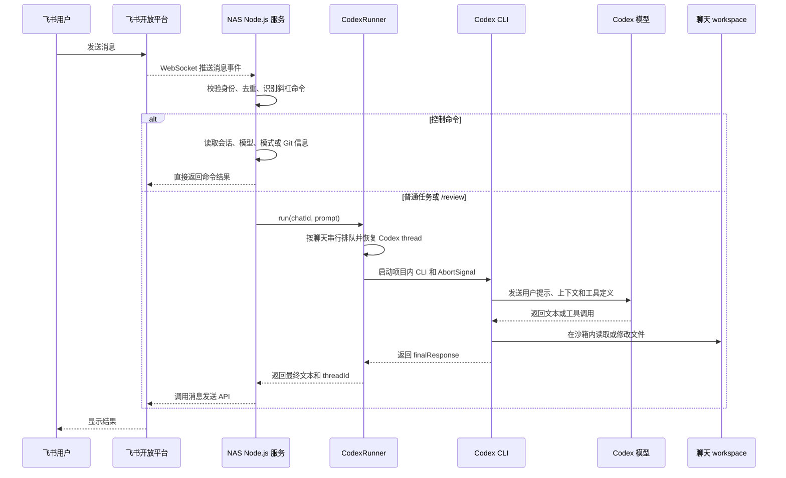

# 飞书远程 Codex 助手

这个项目是独立的飞书机器人服务，通过飞书 WebSocket 长连接接收消息，并调用同一项目内的 Codex SDK 和 Codex CLI 完成任务。运行时不依赖 Codex 桌面应用、VSCode 插件、Docker 或 systemd。

默认 NAS 项目根目录：

```text
/workspace/nas-data/Feishu-Codex-Agent
```

## 数据流



具体数据流：

1. 用户在飞书私聊直接发消息，或在已授权群里 `@机器人` 发消息。
2. 飞书通过 WebSocket 把消息事件推给 NAS 上的 Node.js 服务，不需要公网回调地址。
3. 服务执行私聊/群聊 allowlist、消息去重、长度检查和斜杠命令识别。
4. `/new`、`/status`、`/model`、`/mode`、`/network`、`/files`、`/git`、`/cancel` 等命令由服务直接处理。
5. 普通文本和 `/review` 进入 `CodexRunner`。同一个飞书聊天严格串行，不同聊天可以并发。
6. `CodexRunner` 为每个聊天保存独立的 Codex `threadId` 和 workspace，并恢复上一次会话。
7. Codex SDK 启动项目内 `node_modules/@openai/codex`，使用项目的 `.codex-home` 作为 `CODEX_HOME`。
8. Codex CLI 将提示和工具定义发送给配置的模型与 provider，当前默认是 `gpt-5.5` 和 `huya`。
9. 模型产生的命令、文件修改等工具调用由 Codex CLI 执行。默认 `workspace-write` 沙箱、审批 `never`、网络关闭。
10. 服务通过 Codex SDK 的流式事件发送分析、命令、文件变更和工具调用进度。
11. 工具结果会继续送回模型，直到模型产生最终回答。
12. 服务把最终文本通过飞书发送 API 返回给用户。文件、会话和日志都保存在 NAS 项目目录内。

## 飞书命令

### 会话

- `/new`：清空当前 Codex thread，保留模型、模式和网络设置。也支持 `/reset`、`/clear`。
- `/status`：查看会话、模型、沙箱、网络、目录、运行状态和服务主机。也支持 `/cwd`。
- `/cancel`：通过 `AbortSignal` 取消当前正在执行的 Codex 任务。
- `/help`：显示完整帮助。

### 开发

- `/files [路径]`：最多列出当前聊天 workspace 内的 200 个文件或目录。
- `/git status`：查看当前 workspace 的 Git 分支和文件状态。
- `/git log`：查看最近 10 条提交。
- `/git diff`：查看未暂存变更统计。也支持 `/diff`。
- `/review [额外要求]`：让 Codex 以代码审查模式检查当前 workspace，默认只审查、不修改。

### 配置

- `/model`：查看当前模型。
- `/model gpt-5.5`：为当前飞书聊天切换模型。
- `/model default`：恢复服务配置中的默认模型。
- `/mode`：查看当前沙箱模式。
- `/mode read-only`：只读模式，适合分析和审查。
- `/mode workspace-write`：允许修改当前 workspace，适合正常开发。
- `/mode danger-full-access`：关闭 Codex 沙箱，允许访问整个远程环境。
- `/mode default`：恢复服务配置中的默认模式。
- `/network`：查看当前会话的网络权限。
- `/network on`：允许当前会话内的命令访问网络。
- `/network off`：禁止当前会话内的命令访问网络。
- `/network default`：恢复服务配置中的默认网络设置。

模型、沙箱和网络设置按飞书聊天独立保存。普通 `/new` 不会清除这些设置。

### 多轮对话

- 私聊中直接连续发送消息，同一私聊会自动延续 Codex 上下文。
- 群聊中每条消息都要 @ 机器人，同一群聊共享一个上下文。
- 不同私聊、不同群聊分别保存 `threadId` 和 workspace。
- `/new` 只清除对话上下文，不删除 workspace 文件，也不清除模型、沙箱和网络设置。
- 同一聊天的多个任务按顺序执行，不同聊天可以并发。

### 执行进度

普通任务和 `/review` 执行期间，机器人会发送简短进度，包括分析状态、正在执行的命令、文件变更、MCP 工具调用和搜索。进度消息经过节流；超过 30 秒没有新事件时会发送心跳，避免看起来像没有运行。

进度中不会展示模型的隐藏推理内容。模型完成后再单独返回最终回答；如果确实需要更快返回，可以切换到更快的模型或减少任务的推理范围。

## NAS 部署

项目根目录同时保存源码、Git 工作区、依赖和运行数据：

```text
/workspace/nas-data/Feishu-Codex-Agent
├── .git/
├── .codex-home/       # Codex 登录态和配置，Git 忽略
├── data/              # 会话索引等，Git 忽略
├── logs/              # 服务日志，Git 忽略
├── node_modules/      # npm 依赖，Git 忽略
├── run/               # PID 文件，Git 忽略
├── scripts/
├── src/
├── workspaces/        # 每个飞书聊天的独立工作目录，Git 忽略
├── .env               # 服务配置，Git 忽略
└── .env.lark          # 飞书凭据，Git 忽略
```

首次安装和编译：

```bash
cd /workspace/nas-data/Feishu-Codex-Agent
npm ci
npm run build
mkdir -p .codex-home data logs run workspaces
chmod 600 .env .env.lark .codex-home/auth.json 2>/dev/null || true
```

服务管理：

```bash
bash scripts/service.sh start
bash scripts/service.sh stop
bash scripts/service.sh restart
bash scripts/service.sh status
bash scripts/service.sh logs
```

服务脚本会设置：

```text
CODEX_HOME=<project>/.codex-home
DATA_DIR=<project>/data
WORKSPACE_ROOT=<project>/workspaces
```

这个模式不依赖 systemd。远程主机重启后需要执行一次 `bash scripts/service.sh start`。主机持续在线时，飞书机器人不依赖本机 Codex 应用是否打开。

同一个飞书应用只能运行一个长连接服务实例。部署到 NAS 后，必须停止本机或其他机器上的同应用实例，避免飞书事件被多个客户端分流。

## Git 工作流

NAS 项目目录本身就是 Git 工作区，已配置：

```bash
git config receive.denyCurrentBranch updateInstead
```

因此开发机可以推送到一个干净的项目根目录，Git 会同步更新工作树。

开发机推送：

```bash
git push nas main
```

NAS 更新依赖、编译并重启：

```bash
cd /workspace/nas-data/Feishu-Codex-Agent
npm ci
npm run build
bash scripts/service.sh restart
```

本机 Git 使用系统 OpenSSH 与 `notebook` 主机别名连接 NAS。密钥带口令时，推送前需确保 Windows `ssh-agent` 已加载对应密钥。

## 首次创建飞书应用

需要 Node.js 20.12 或更高版本。

```bash
npm install
npm run setup
```

终端会输出飞书授权链接。脚本会自动申请：

- 机器人能力
- `im.message.receive_v1`
- `im:message.p2p_msg:readonly`
- `im:message.group_at_msg:readonly`
- `im:message:send_as_bot`

App ID、App Secret 和应用创建者的 Open ID 会写入 `.env.lark`。企业环境还需要在飞书开放平台发布版本并确认可用范围。

## 群聊授权

先把机器人加入群，并发送一条 `@机器人 /help`。未授权群会被安全策略静默拒绝，日志中会记录 `chatId`：

```bash
grep message.rejected logs/feishu-codex-agent.log
```

把目标群 ID 写入 `.env`：

```dotenv
FEISHU_ALLOWED_CHAT_IDS=oc_xxx,oc_yyy
```

重启：

```bash
bash scripts/service.sh restart
```

## 配置

常用 `.env` 配置：

```dotenv
CODEX_MODEL=gpt-5.5
CODEX_SANDBOX=workspace-write
CODEX_NETWORK_ACCESS=false
FEISHU_ALLOWED_CHAT_IDS=
MAX_CONCURRENT_RUNS=2
MAX_PROMPT_CHARS=12000
PORT=3000
```

`CODEX_MODEL` 会作为每次运行的显式模型参数传给 Codex，因此不会随 Codex 应用的当前对话设置或全局默认模型变化。

服务默认值也可以在启动时通过环境变量覆盖：

```bash
CODEX_SANDBOX=danger-full-access \
CODEX_NETWORK_ACCESS=true \
bash scripts/service.sh restart
```

飞书中的 `/mode` 和 `/network` 只影响当前聊天，并优先于服务默认值。

## 安全边界

默认使用：

- Codex 沙箱：`workspace-write`
- Codex 网络：关闭
- Codex 审批：`never`
- 私聊：仅应用创建者和 `FEISHU_ALLOWED_OPEN_IDS`
- 群聊：默认禁用，只响应 `FEISHU_ALLOWED_CHAT_IDS`

`danger-full-access` 会关闭 Codex 沙箱，并允许远程任务访问当前进程可见的完整文件系统；配合审批 `never` 时，命令会自动执行。只应在专用、隔离且可随时销毁的远程环境中使用。不要提交 `.env`、`.env.lark` 或 `.codex-home/auth.json`。

## 当前限制

- 只处理文本任务，不处理语音和图片附件。
- `/cancel` 只取消当前运行任务，已经在同一聊天排队的后续任务仍会继续。
- 飞书长连接只支持单服务副本。扩容前需要增加分布式队列并拆分接收与执行服务。
